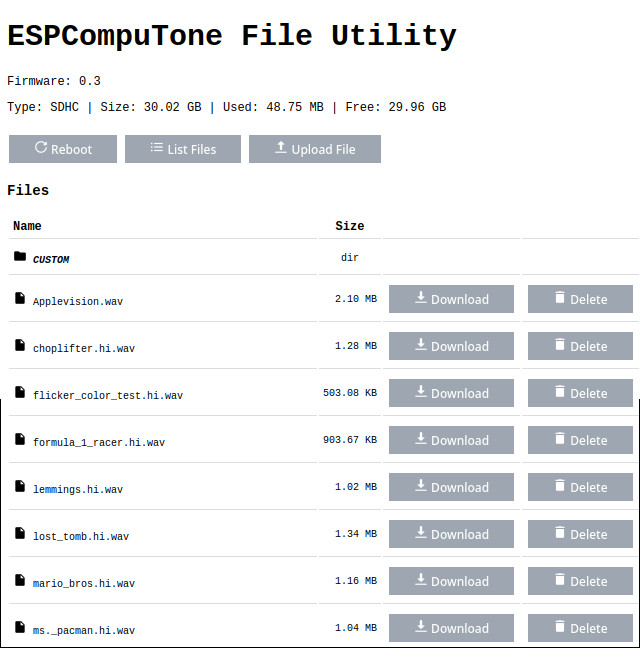
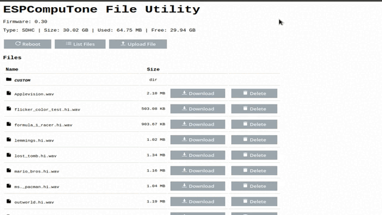

# ESP32 Based Digital recorder

This project aims to be a replacement for cassette recorders for retro computers, as well as a digital recorder.

* Note: Under development


Prototype:


Webserver:

 


### Specifications

*   ESP32-S (WROOM)
*   SD Card
*   ILI9341 TFT with touch
*   PCM5102 DAC
*   PCM1808 ADC
*   LovyanGFX
*   LVGL 9


### Wiring

    Pinout (ESP32)

    SD CARD         PCM1808 (ADC)      PCM5102 (DAC)     PCF8574            ILI9341
    -------------------------------------------------------------------------------------------
    VCC  3,3v       VCC   3,3v-5v      VCC   3,3v        VCC    3,3v        VCC    3,3v
    GND  GND        GND   GND          GND   GND         GND    GND         GND    GND
    CS   GPIO4      BCK   GPIO26       SCK   GPIO0       SDA    GPIO21      LED    3,3v
    MISO GPIO19     OUT   GPIO35       BCK   GPIO26      SCL    GPIO22      MISO   GPIO27
    SCK  GPIO12     LRC   GPIO33       DIN   GPIO25                         SCK    GPIO14
    MOSI GPIO23     SCK   GPIO0        LCK   GPIO33                         MOSI   GPIO13
                                                                            DC     GPÌO15
                                                                            RST    GPIO32
                                                                            CS     GPIO2
                                                                            TCS    GPIO18   
                                                                            TIRQ   GPIO5
                                                                            


### Firmware install

Please install first [PlatformIO](http://platformio.org/) open source ecosystem for IoT development compatible with **Arduino** IDE and its command line tools (Windows, MacOs and Linux). Also, you may need to install [git](http://git-scm.com/) in your system. 

Before the first run, load the icons and assets with:

```bash
pio run --target uploadfs
```


### TO DO

- [x] Play (WAV Format)
- [x] Record (WAV Format)
- [x] File transfer over WiFi
- [ ] Other file support (MP3, TAP, TZX...)
- [ ] Configuration Screen
- [x] File Utilities (web page)
- [ ] Splash screen
- [ ] Play Bluetooth Audio
- [ ] PSRAM support (WROVER)
- [x] Review Audio Task
- [ ] Review Keys Events
- [ ] PCB
- [x] Battery Support
- [ ] Remote connector support
- [ ] Internal Speaker
- [ ] 3D Printed case


